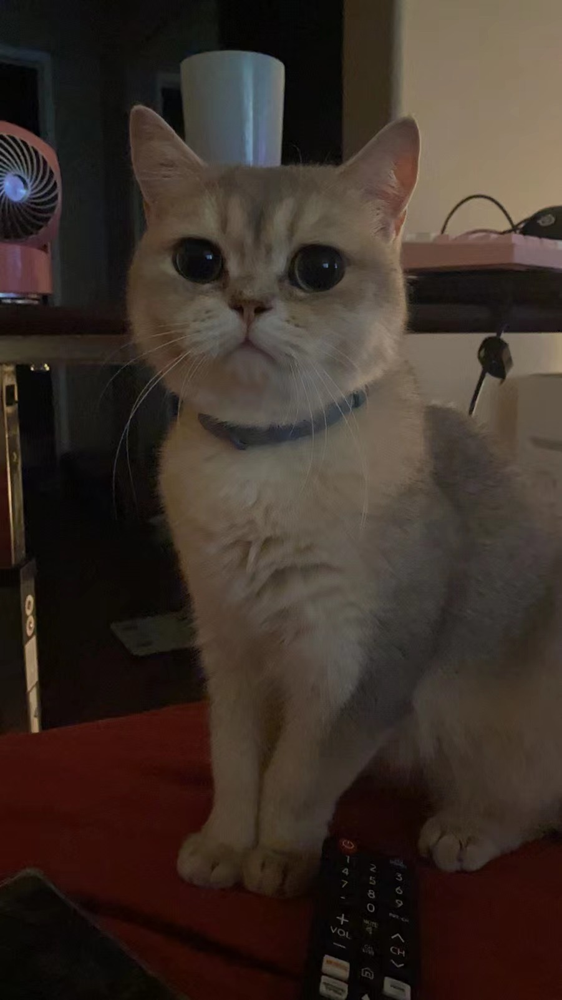

# Zixuan Chen
## Math-CS Major
### Moba enthusiast
#### Important facts about me: ###
I'm a third year Math-CS student who is passionate in **Coding**, **Basketball** as well as **moba-games** *(especially DOTA2!)* \
I also have a cat named pekaboo:\
\
[More picture but using relative link](diangun2.HEIC)\
List of CS course taken:\
<ol>
<li>lower</li>
    <ul>
    <li>CSE 8A</li>
    <li>CSE 8B</li>
    <li>CSE 12</li>
    <li>CSE 15L</li>
    <li>CSE 30</li>
    <li>CSE 20</li>
    </ul>
<li>upper</li>
    <ul>
    <li>CSE 100</li>
    <li>CSE 105</li>
    <li>CSE 140</li>
    <li>CSE 140L</li>
    <li>CSE 101(current)</li>
    <li>CSE 110(current)</li>
    <li>CSE 142(current)</li>
    <li>CSE 142L(current)</li>
    </ul>
</ol>

## Favorite quote
>Fortune favors the bold
Some of the git commands that I have practiced in order to complete this lab:
```
git add
git commit
git push
git branch
```

Personal favourite website:[google](google.com),[LOL](https://www.leagueoflegends.com/en-us/)\
Goal of the year:
- [x] dunk in a game
- [ ] complete a coding project in CSE 110
[top Of Page](#Zixuan-Chen)
